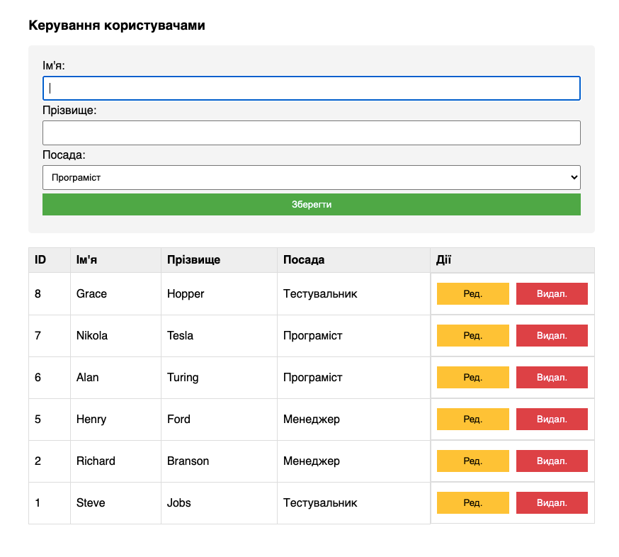
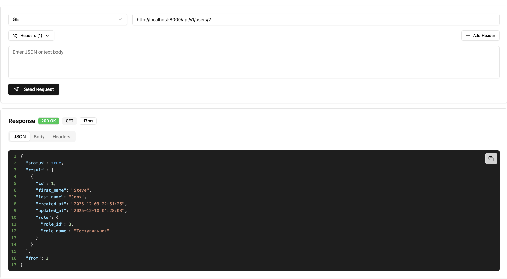

# Test task

> Так як не було жорстких рамок, але хотілось легкої гнучкості в рішенні, було прийнято рішення зібрати на коліні
> простий велосипед

# Завдання №1

## HOW TO

- run `docker compose up task-0`
- run `php -f install.php` inside the PHP container (`task-0`)
- go to http://localhost:8000

## Основний інтерфейс користувача

Можливості інтерфейсу

- Додавати
- Редагувати
- Видаляти

> Також є не реалізована можливість на стороні UI підвантажувати дані користувачів

# Завдання №2

Результат роботи знаходиться в `/query/query.php`

### EXPLAIN

> Спробував трохи додавати індекси, для оптимізації запитів

| id | select\_type | table | partitions | type    | possible\_keys                                                                                              | key                   | key\_len | ref                                        | rows | filtered | Extra                                        |
|:---|:-------------|:------|:-----------|:--------|:------------------------------------------------------------------------------------------------------------|:----------------------|:---------|:-------------------------------------------|:-----|:---------|:---------------------------------------------|
| 1  | SIMPLE       | agfv  | null       | index   | good\_id\_2,good\_id,textile\_filed\_id,textile\_filed\_value\_id,idx\_agfv\_good\_id,idx\_agfv\_full\_join | idx\_agfv\_full\_join | 12       | null                                       | 4    | 100      | Using index; Using temporary; Using filesort |
| 1  | SIMPLE       | af    | null       | eq\_ref | PRIMARY,idx\_af\_is\_deleted                                                                                | PRIMARY               | 4        | tl\_test.agfv.additional\_field\_id        | 1    | 100      | Using where                                  |
| 1  | SIMPLE       | g     | null       | eq\_ref | PRIMARY                                                                                                     | PRIMARY               | 4        | tl\_test.agfv.good\_id                     | 1    | 100      | null                                         |
| 1  | SIMPLE       | afv   | null       | eq\_ref | PRIMARY,idx\_afv\_is\_deleted                                                                               | PRIMARY               | 4        | tl\_test.agfv.additional\_field\_value\_id | 1    | 100      | Using where                                  |

### EXPLAIN ANALYZE

| EXPLAIN                                                                                                                                                                                                                                                                                                                                                                                                                                                                                                                                                                                                                                                                                                                                                                                                                                                                                                                                                                                                                                                                                                                                                                                                                                                                                                                                                                                                                                                                                                                                                                                                                                          |
|:-------------------------------------------------------------------------------------------------------------------------------------------------------------------------------------------------------------------------------------------------------------------------------------------------------------------------------------------------------------------------------------------------------------------------------------------------------------------------------------------------------------------------------------------------------------------------------------------------------------------------------------------------------------------------------------------------------------------------------------------------------------------------------------------------------------------------------------------------------------------------------------------------------------------------------------------------------------------------------------------------------------------------------------------------------------------------------------------------------------------------------------------------------------------------------------------------------------------------------------------------------------------------------------------------------------------------------------------------------------------------------------------------------------------------------------------------------------------------------------------------------------------------------------------------------------------------------------------------------------------------------------------------|
| -&gt; Sort row IDs: g.id, g.\`name\`  \(actual time=0.19..0.191 rows=2 loops=1\)     -&gt; Table scan on &lt;temporary&gt;  \(actual time=0.155..0.157 rows=2 loops=1\)         -&gt; Aggregate using temporary table  \(actual time=0.154..0.154 rows=2 loops=1\)             -&gt; Nested loop inner join  \(cost=4.85 rows=4\) \(actual time=0.0965..0.125 rows=4 loops=1\)                 -&gt; Nested loop inner join  \(cost=3.45 rows=4\) \(actual time=0.0351..0.0558 rows=4 loops=1\)                     -&gt; Nested loop inner join  \(cost=2.05 rows=4\) \(actual time=0.0313..0.0477 rows=4 loops=1\)                         -&gt; Covering index scan on agfv using idx\_agfv\_full\_join  \(cost=0.65 rows=4\) \(actual time=0.0171..0.0205 rows=4 loops=1\)                         -&gt; Filter: \(af.is\_deleted = 0\)  \(cost=0.275 rows=1\) \(actual time=0.00485..0.00501 rows=1 loops=4\)                             -&gt; Single-row index lookup on af using PRIMARY \(id = agfv.additional\_field\_id\)  \(cost=0.275 rows=1\) \(actual time=0.00437..0.00442 rows=1 loops=4\)                     -&gt; Single-row index lookup on g using PRIMARY \(id = agfv.good\_id\)  \(cost=0.275 rows=1\) \(actual time=0.00153..0.00159 rows=1 loops=4\)                 -&gt; Filter: \(afv.is\_deleted = 0\)  \(cost=0.275 rows=1\) \(actual time=0.0165..0.0167 rows=1 loops=4\)                     -&gt; Single-row index lookup on afv using PRIMARY \(id = agfv.additional\_field\_value\_id\)  \(cost=0.275 rows=1\) \(actual time=0.016..0.0161 rows=1 loops=4\)  |

# Summary

> Висновок: Вважаюю, що потрібно деяку агрегацію перенести на рівень прогррами PHP